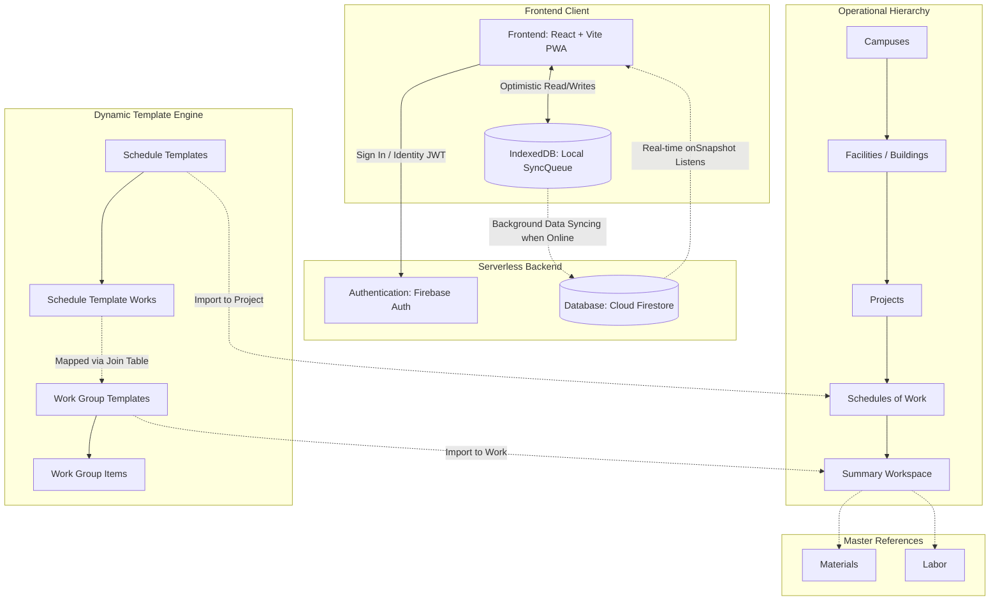
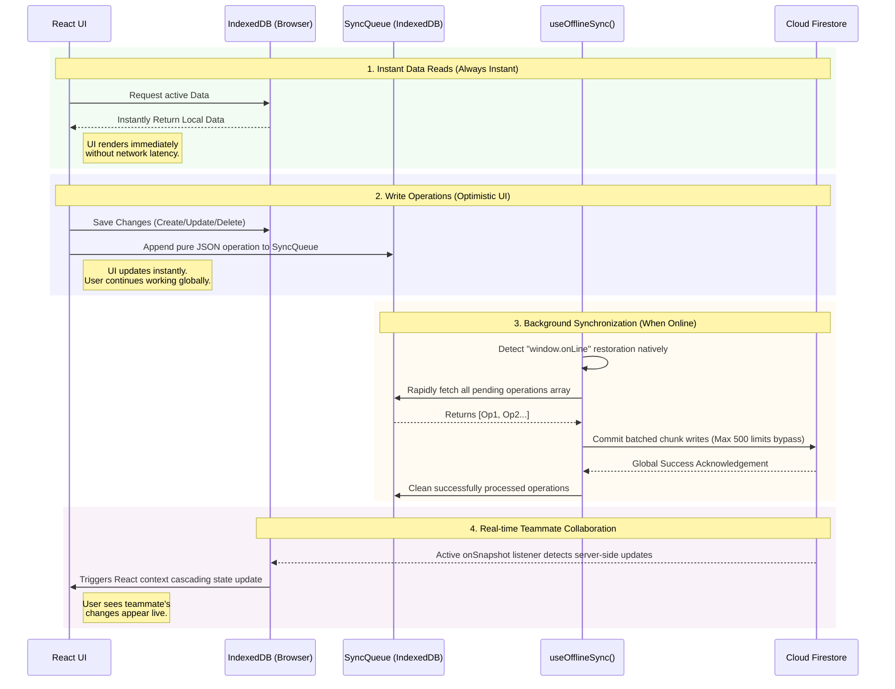
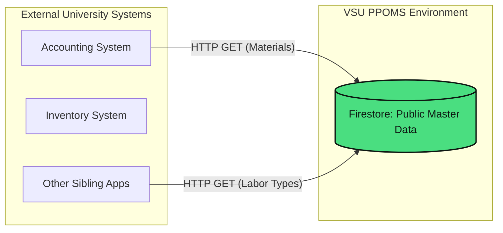

# PPOMS - Project Price & Operations Management System
### Visayas State University (VSU) - Property and Procurement Office (PPO)

A robust, offline-first web application designed for the Visayas State University PPO to manage campuses, facilities, projects, and operational data seamlessly.

## Key Features
- **Comprehensive Project Management**: Track operations across multiple campuses, facilities, and projects in a hierarchical structure.
- **Offline-First Data Architecture**: Work seamlessly without an internet connection utilizing optimistic UI updates and local browser storage.
- **Real-Time Collaboration**: Changes synchronize instantly for all users via Firebase's real-time publish-subscribe engine whenever the system is online.
- **Master Data Center**: Manage and categorize materials and labor resources centrally for use across projects.
- **Role-Based Access Control (RBAC)**: Enforced security models protecting administration routes, distinctly dividing `admin` and `super_admin` access levels.
- **Progressive Web App (PWA)**: Completely installable as a standalone application on desktop or mobile environments for a native-like experience.

## Setup and maintainer documentation

Start with the setup guide. It covers the exact Node version, Firebase project creation, environment variables, Google sign-in, Firestore rules and indexes, first-super-admin seeding, rule tests, and Netlify deployment.

- [Set up PPOMS from a clean machine](docs/SETUP.md)
- [Migrate PPOMS to another Firebase project](docs/FIREBASE_MIGRATION.md)
- [System and data reference](docs/SYSTEM_REFERENCE.md)

Quick local check after creating `.env.local` from `.env.example`:

```bash
npm ci
npm run build
npm run dev
```

## System Structure



## Offline & Online Synchronization Engine

PPOMS natively bypasses patchy network connectivity via a highly resilient offline-first strategy:



1. **Instant Local Writes**: All data edits (Creation, Updates, and Deletion) are immediately written to an IndexedDB background queue (`SyncQueue`). Your screen continuously updates instantly without spinner locks or network handshake delays.
2. **Background Re-Connectivity Engine**: Monitoring the `window.onLine` state, the robust `useOfflineSync` engine awakens the millisecond internet is restored. It translates the pending local operations and pushes them up to the cloud transparently.
3. **Data Chunking**: To prevent data-loss or rate-limiting during massive offline sync sessions, the queuing engine automatically slices large loads (e.g. 5,000 edits) into chunks (Batches of 500) and commits them globally in parallel.
4. **Live Subscriptions**: When fully online, active Firestore `onSnapshot` engines stay persistent, seamlessly trickling multi-user real-time edits right back down into the local screen.
5. **Zero-Latency Cross-Component Sync**: Using a highly-custom pub/sub DOM Event API (`localDataUpdated`), changes made in isolated modals immediately alert parallel components across the UI. This eliminates local state desync without depending on top-down prop drilling or external state management libraries!

## Dynamic Template Engine

PPOMS includes a high-performance, reusable template system designed to eliminate redundant manual data entry for standard project types:

- **Work Group Templates**: Presets for categorized work Details. Includes standard material lists, labor crews, and bulk items. Templates can be defined as `Material`, `Labor`, or `Bulk`, with preset indirect cost percentages (OCM, Tools, Labor overheads).
- **Schedule Templates**: Structural hierarchies for Program of Works. These allow developers to define standard project phases (e.g., "Foundation", "Structure", "Finishes") once and reuse them globally.
- **Hierarchical Deep-Cloning**: When a Schedule Template is imported into a project:
    1.  The system clones the multi-level work structure.
    2.  It automatically resolves and assigns project-specific **Work Codes**.
    3.  It fetches all associated **Work Group Templates** and their child items.
    4.  It performs a **Bottom-Up Cost Recomputation**, ensuring the Project Total instantly reflects the cloned items' current registry prices.
- **Project-Wide Cost Cascading**: PPOMS features a deep recomputation engine (`recomputeProjectCostsDeep`). When global project percentages (like OCM or Tools overhead) are updated in the project settings, the system automatically scans every associated work detail and category, recalculating thousands of line items to ensure financial accuracy.

## Database Schema (IndexedDB V7)

The local database architecture has evolved to support complex relational templates while maintaining offline performance:

| Store | Purpose | Key Indices |
| :--- | :--- | :--- |
| `workGroupTemplates` | Master list of reusable cost categories | `id` |
| `workGroupTemplateItems` | Individual items within a group template | `templateId` |
| `scheduleTemplates` | Registry of Program of Works structures | `id` |
| `scheduleTemplateWorks` | Hierarchical works within a template | `templateId`, `parentId` |
| `scheduleTemplateWorkGroups` | Join table linking Schedule Works to Group Templates | `scheduleTemplateWorkId` |

## External API Integrations

The PPOMS master data ecosystem is securely decoupled and exposes its central data natively for other authorized cross-department integration.



By segregating master-data rules structurally, external systems can consume the live PPOMS material and labor pricing references through Firestore's REST API. These collections are intentionally public-readable; review that policy in the [system reference](docs/SYSTEM_REFERENCE.md#authorization-model) before every production deployment.

## Scalability

The PPOMS architecture guarantees extreme horizontal and vertical scalability without crippling performance drops:
- **Serverless Node Architecture**: Supported by Google's Firebase, eliminating the need to over-provision hardware. Scalability to millions of rows operates globally using serverless CDNs.
- **Virtually Infinite Client Rendering**: Incredibly heavy lists (thousands of material records and schedule inputs) use DOM `Virtualization`. React only physically renders the handful of data rows currently visible on your monitor, ensuring UI frame rates stay consistently silky on any end user's machine.
- **Parallel Chunk Execution**: Network requests are batched instead of executed sequentially saving hundreds of MS per query while bypassing remote database bottlenecks for instantaneous saves at enormous scales.
- **Vite Bundling Limits**: Employing bleeding-edge dynamic code splitting ensures JavaScript delivery is kept extraordinarily minimal. Each feature chunk is dynamically side-loaded only on demand.
