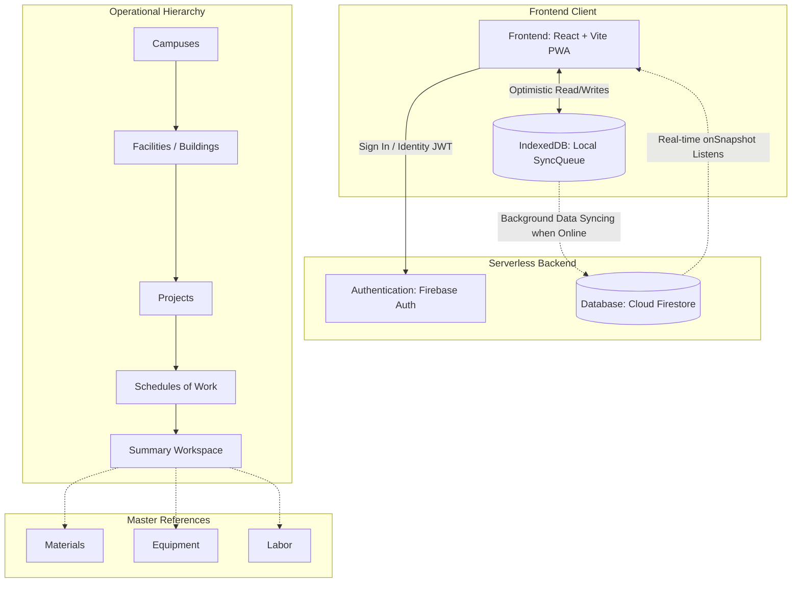
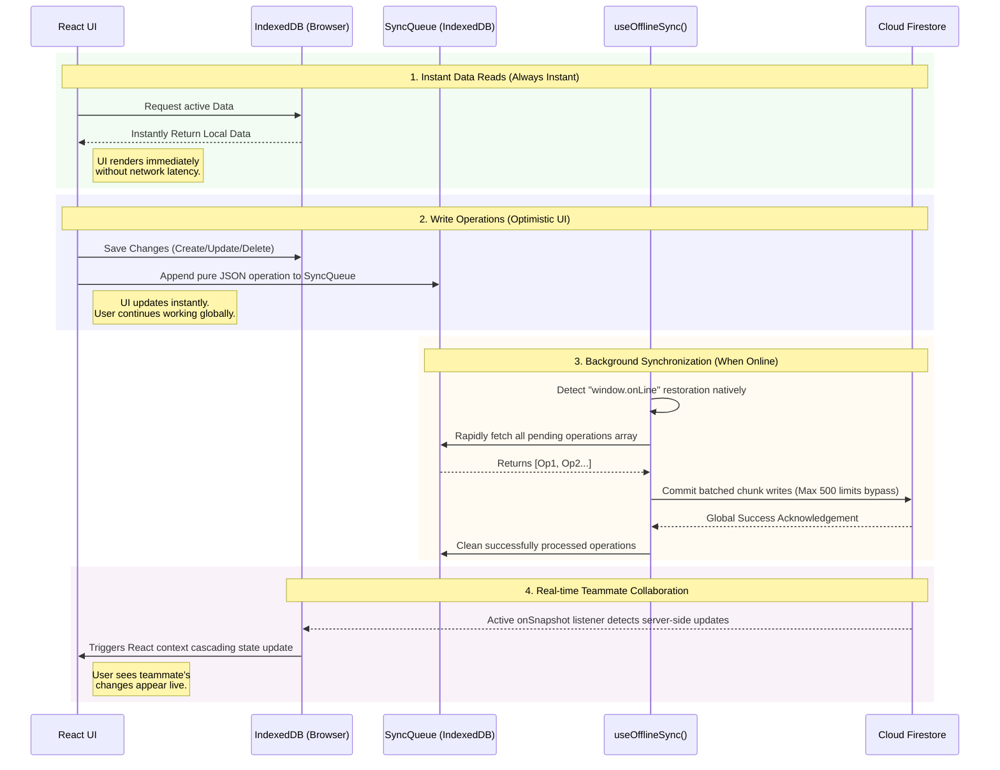

# PPOMS - Project Price & Operations Management System
### Visayas State University (VSU) - Physical Plant Office (PPO)

A robust, offline-first web application designed for the Visayas State University PPO to manage campuses, facilities, projects, and operational data seamlessly.

## Key Features
- **Comprehensive Project Management**: Track operations across multiple campuses, facilities, and projects in a hierarchical structure.
- **Offline-First Data Architecture**: Work seamlessly without an internet connection utilizing optimistic UI updates and local browser storage.
- **Real-Time Collaboration**: Changes synchronize instantly for all users via Firebase's real-time publish-subscribe engine whenever the system is online.
- **Master Data Center**: Manage and categorize Materials (Catalogs), Equipment, and Labor Resources centrally to be utilized across numerous projects.
- **Role-Based Access Control (RBAC)**: Enforced security models protecting administration routes, distinctly dividing `admin` and `super_admin` access levels.
- **Progressive Web App (PWA)**: Completely installable as a standalone application on desktop or mobile environments for a native-like experience.

## System Structure

## Offline & Online Synchronization Engine

PPOMS natively bypasses patchy network connectivity via a highly resilient offline-first strategy:

1. **Instant Local Writes**: All data edits (Creation, Updates, and Deletion) are immediately written to an IndexedDB background queue (`SyncQueue`). Your screen continuously updates instantly without spinner locks or network handshake delays.
2. **Background Re-Connectivity Engine**: Monitoring the `window.onLine` state, the robust `useOfflineSync` engine awakens the millisecond internet is restored. It translates the pending local operations and pushes them up to the cloud transparently.
3. **Data Chunking**: To prevent data-loss or rate-limiting during massive offline sync sessions, the queuing engine automatically slices large loads (e.g. 5,000 edits) into chunks (Batches of 500) and commits them globally in parallel.
4. **Live Subscriptions**: When fully online, active Firestore `onSnapshot` engines stay persistent, seamlessly trickling multi-user real-time edits right back down into the local screen.

## Scalability

The PPOMS architecture guarantees extreme horizontal and vertical scalability without crippling performance drops:
- **Serverless Node Architecture**: Supported by Google's Firebase, eliminating the need to over-provision hardware. Scalability to millions of rows operates globally using serverless CDNs.
- **Virtually Infinite Client Rendering**: Incredibly heavy lists (thousands of material records and schedule inputs) use DOM `Virtualization`. React only physically renders the handful of data rows currently visible on your monitor, ensuring UI frame rates stay consistently silky on any end user's machine.
- **Parallel Chunk Execution**: Network requests are batched instead of executed sequentially saving hundreds of MS per query while bypassing remote database bottlenecks for instantaneous saves at enormous scales.
- **Vite Bundling Limits**: Employing bleeding-edge dynamic code splitting ensures JavaScript delivery is kept extraordinarily minimal. Each feature chunk is dynamically side-loaded only on demand.
